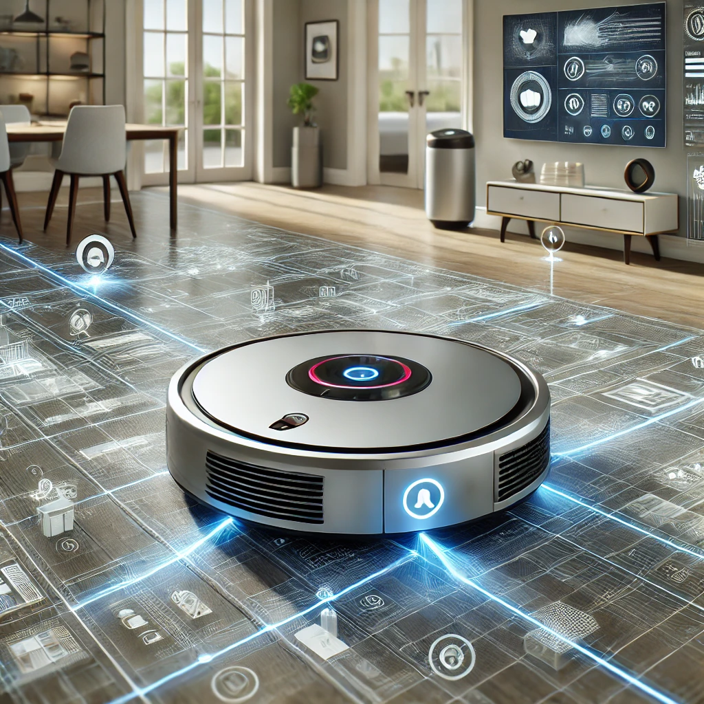

## Cleaner - Intelligent Vacuum Robot with AI

This repository is available in multiple languages:

- [Português](README.md)
- [Español](README-es.md)

---



---

### Technologies Used:

- **Python**: The language chosen for its simplicity and efficiency in implementing algorithms and solving complex problems.
- **Object-Oriented Programming (OOP)**: Classes and objects to represent the robot and the environment.
- **Autonomous Algorithms**: Control logic based on the state of the rooms, utilizing decision-making techniques.
- **Artificial Intelligence**: The project applies **supervised learning** and **unsupervised learning** methods to optimize the robot's cleaning strategy.

---

### Project Overview:

This project simulates the behavior of an intelligent vacuum robot that can move between various rooms and clean them based on different control strategies. The robot can operate in manual mode, where the user commands its actions, or in autonomous mode, where the robot makes decisions based on the dirt detected in the rooms.

The AI-driven features use **supervised learning** to recognize patterns in room cleanliness and **unsupervised learning** to adapt the robot’s cleaning approach based on environmental conditions and previous experiences.

**Control strategies include**:
1. **Base Control**: The robot follows a predefined path cleaning rooms based on its current position.
2. **Manual Control**: The user directly controls the robot's movements.
3. **Omniscient Control**: The robot knows the position of all dirt and chooses the ideal order to clean.

---

### How to Run the Project:

**Prerequisites**:
- Ensure that **Python** is installed on your machine. If not, download it from [python.org](https://www.python.org/downloads/).

**Installing the Project**:

1. Clone the repository:
    ```bash
    git clone https://github.com/YourUsername/IntelligentVacuumRobot.git
    cd IntelligentVacuumRobot
    ```

2. Run the program:
    ```bash
    python main.py
    ```

---

### Code Logic Breakdown:

#### **Cleaner.py**:
The `Cleaner` class represents the vacuum robot, responsible for:
- Cleaning the room it is located in.
- Moving left or right between rooms.
- Checking if the room is dirty.
- Updating its memory by recording the cleaned rooms.

Main Methods:
- `limpar(salas)`: Cleans the room.
- `mover_direita(salas)`: Moves the robot to the room on the right.
- `mover_esquerda(salas)`: Moves the robot to the room on the left.
- `verifica_limpo(salas)`: Checks if the room is dirty.
- `atualiza_memoria()`: Records the cleaned room in the robot’s memory.

#### **Controlador.py**:
The controller manages the robot's movement and cleaning with several control logics:

1. **logica_robo_base**: The robot moves from left to right, cleaning rooms.
2. **logica_robo_onisciente**: The robot, knowing the location of dirt, chooses the optimal cleaning order.
3. **manual_base**: The robot is manually controlled by the user, with options to move, clean, or stop the program.
4. **Auxiliary functions**: Like `verifica_sujeira_longe`, which identifies the farthest dirt.

#### **AI Features**:
- **Base Mode**: The robot uses a simple logic, moving between rooms in a predefined pattern and cleaning sequentially.
- **Omniscient Mode**: The robot has prior knowledge of the location of all dirt and plans the optimal cleaning order, optimizing time and efficiency.

---

### 👨‍💼 Author

<table>
  <tr>
    <td align="center">
      <a href="#">
        <br>
        <sub>
          <b>Gian Dutra</b>
        </sub>
      </a>
    </td>
  </tr>
</table>
